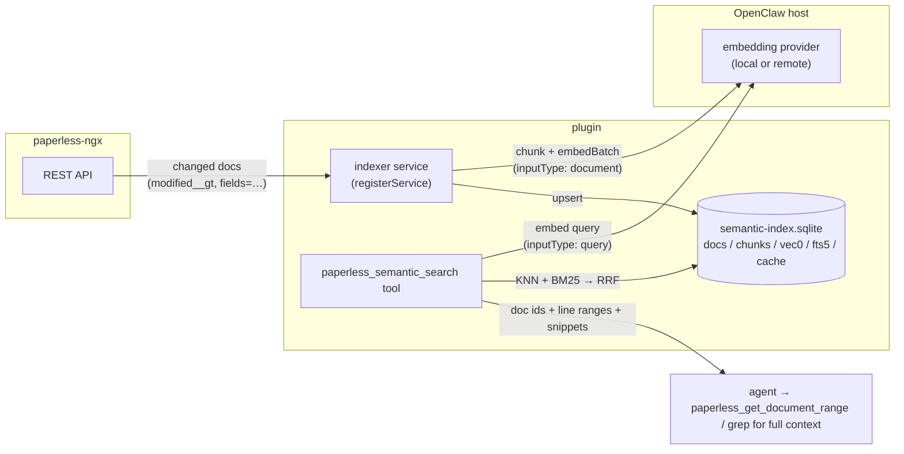
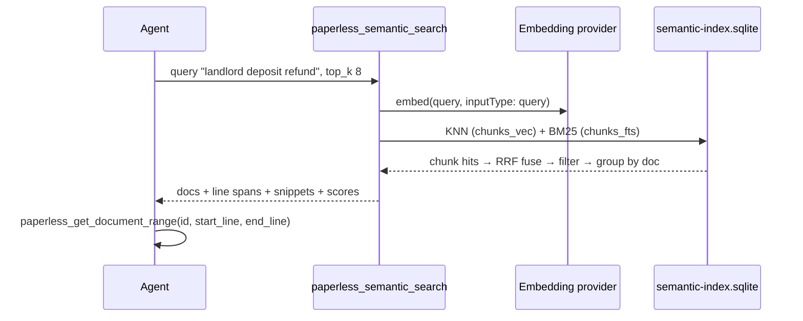

# Proposal: AI Embedding Semantic Search

Status: **draft / for discussion** — nothing in this document is implemented yet.

## Motivation

Today the plugin's retrieval story is entirely lexical: `paperless_list_documents` wraps
paperless-ngx's Whoosh full-text `search`/`query`, and `paperless_grep_document` /
`paperless_get_document_range` drill into a single document. That works well when the user's
words appear in the OCR text, and fails when they don't:

- "find my car insurance policy" misses a German "KFZ-Haftpflicht Versicherungsschein"
- "what did the landlord say about the deposit" misses "Kaution" / "security deposit refund"
- OCR noise ("lnvoice", broken ligatures) silently defeats exact term matching
- "documents about my knee surgery" has no single keyword at all

Embedding-based semantic search fixes exactly this class of failure: queries and document
chunks are compared in vector space, so synonyms, cross-language phrasing, and OCR-mangled
terms still land near each other. For an agent doing RAG over a personal document archive,
this is the difference between "retrieval works if the user guesses the right words" and
"retrieval works".

## Constraints and prior art

Three facts shape the design:

1. **paperless-ngx has no server-side embedding support.** The REST API (see
   `src/generated/paperless-schema.d.ts`) exposes lexical search only — there is no
   similarity/vector/embedding endpoint to delegate to. Third-party sidecars
   (paperless-ai, paperless-gpt) exist but bring their own deployment, auth, and API
   surface; depending on one would make the plugin useless for everyone who doesn't run it.
2. **OpenClaw already ships the entire embedding + vector-index toolchain, exposed to
   plugins.** The host's memory subsystem (`memory-core`) indexes markdown/session files
   into a SQLite database using `node:sqlite` + the `sqlite-vec` extension, with hybrid
   FTS5 + vector retrieval, an embedding cache, and pluggable embedding providers (local
   model via node-llama-cpp, or remote OpenAI/Gemini/Voyage-style APIs). Critically, the
   plugin SDK re-exports the building blocks:
   - `openclaw/plugin-sdk/embedding-providers` — `getEmbeddingProvider(id, cfg)` /
     `listEmbeddingProviders(cfg)` resolving to an `EmbeddingProvider` with
     `embed(input, { inputType: "query" | "document" })`, `embedBatch(...)`,
     `dimensions`, `maxInputTokens`, plus an index-identity contract
     (`EmbeddingProviderIndexIdentity`) for detecting "the index was built with a
     different model".
   - `openclaw/plugin-sdk/memory-core-host-engine-storage` — `requireNodeSqlite()`,
     `loadSqliteVecExtension(...)`, `chunkMarkdown(content, { tokens, overlap })`,
     `hashText`, `cosineSimilarity`, `runWithConcurrency`, `ensureDir`.
   - `api.registerService({ id, start(ctx), stop(ctx) })` — a host-managed background
     service with a per-plugin `ctx.stateDir` for persistent local state.
3. **This plugin deliberately mirrors the API, not workflows.** Whatever we add should be
   more generic tools an agent composes, not a monolithic "RAG pipeline" — consistent with
   the existing grep/range tools that exist to feed an agent targeted context.

## Options considered

| Option | Verdict |
| --- | --- |
| **A. Wait for / rely on paperless-ngx server-side AI** | No such API exists; not on the project's near-term roadmap. Nothing to build against. |
| **B. Require a sidecar (paperless-ai, external vector DB like Qdrant/Chroma)** | Extra infrastructure every user must deploy and secure; couples the plugin to a third project's API stability. Poor fit for the "install plugin, paste token" UX this plugin has. |
| **C. Query-time-only embeddings (embed the top-N lexical results and rerank)** | Cheap and index-free, but it can only *reorder* what keyword search already found — it cannot recover documents lexical search missed, which is the main motivation. Worth having later as a reranker, not as the core. |
| **D. Plugin-owned local index: chunk + embed documents into SQLite (sqlite-vec + FTS5) under the plugin's state dir, using OpenClaw's embedding providers** | **Recommended.** Zero extra infrastructure, reuses the exact stack the host's own memory search uses, works with a local embedding model for privacy, degrades cleanly when disabled. |

The rest of this document details option D.

## Architecture overview



Four pieces, each described below:

1. an **index store** (one SQLite file in the plugin's state dir),
2. an **indexer** (incremental sync from paperless-ngx → chunks → embeddings),
3. a **query path** (new agent tools),
4. **configuration** (opt-in, provider selection, privacy posture).

### 1. Index store

One SQLite database at `<stateDir>/semantic-index.sqlite` (the `stateDir` handed to the
plugin's registered service), opened via `requireNodeSqlite()` with the `sqlite-vec`
extension loaded through `loadSqliteVecExtension(...)` — both already shipped by the host
for memory-core, so the plugin adds **no native dependencies**.

Schema (plugin-owned, versioned):

```sql
-- one row per paperless document we have indexed
CREATE TABLE docs (
  id            INTEGER PRIMARY KEY,   -- paperless document id
  modified      TEXT NOT NULL,         -- paperless `modified` timestamp at index time
  checksum      TEXT,                  -- paperless source checksum
  content_hash  TEXT NOT NULL,         -- hashText(normalized OCR content)
  title         TEXT,
  correspondent_id  INTEGER,
  document_type_id  INTEGER,
  tag_ids       TEXT NOT NULL DEFAULT '[]',  -- JSON array, for filter pushdown
  created       TEXT,                  -- for date-range filters
  indexed_at    TEXT NOT NULL
);

-- one row per chunk; line spans let results chain into the existing range/grep tools
CREATE TABLE chunks (
  id          INTEGER PRIMARY KEY,
  doc_id      INTEGER NOT NULL REFERENCES docs(id) ON DELETE CASCADE,
  chunk_index INTEGER NOT NULL,
  start_line  INTEGER NOT NULL,
  end_line    INTEGER NOT NULL,
  text        TEXT NOT NULL            -- chunk text, kept for snippets + FTS (see privacy note)
);

-- sqlite-vec virtual table; rowid = chunks.id
CREATE VIRTUAL TABLE chunks_vec USING vec0(embedding float[{dims}]);

-- FTS5 over chunk text for the hybrid keyword leg; rowid = chunks.id
CREATE VIRTUAL TABLE chunks_fts USING fts5(text, content='chunks', content_rowid='id');

-- content-addressed embedding cache: hash(model ⊕ text) → vector
CREATE TABLE embedding_cache (
  key     TEXT PRIMARY KEY,
  vector  BLOB NOT NULL
);

-- single-row index identity + sync checkpoint
CREATE TABLE meta (
  schema_version INTEGER,
  provider TEXT, model TEXT, provider_key TEXT, dims INTEGER,
  chunk_tokens INTEGER, chunk_overlap INTEGER,
  last_sync_started TEXT, last_sync_completed TEXT,
  sync_checkpoint TEXT                 -- max `modified` fully processed
);
```

Design points:

- **Chunk-level, not document-level vectors.** A 40-page contract averaged into one vector
  matches nothing well. Chunking (default ~400 tokens, ~80 overlap, via the SDK's
  `chunkMarkdown`) is what makes results precise enough to feed RAG: each hit carries a
  `doc_id + start_line..end_line` span the agent can pull with
  `paperless_get_document_range`.
- **Index identity mirrors memory-core.** `meta` records provider/model/dims (and the
  provider's `EmbeddingProviderIndexIdentity.cacheKeyData`). On startup, a mismatch —
  user switched embedding model — marks the index stale and triggers a full rebuild
  rather than silently mixing vector spaces.
- **Embedding cache** keyed by `hashText(model + "\0" + chunkText)` makes rebuilds and
  re-syncs of unchanged text nearly free, and dedupes identical chunks across documents
  (letterheads, footers).
- **`content_hash` short-circuit:** a document whose `modified` changed but whose OCR
  content hash is unchanged (e.g. tag edits — which paperless bumps `modified` for) only
  updates the metadata columns; no re-chunking, no embedding calls.

### 2. Indexer (sync)

Registered as a background service:

```ts
api.registerService({
  id: "paperless-ngx-semantic-index",
  start(ctx) { /* open DB in ctx.stateDir, schedule sync loop */ },
  stop(ctx)  { /* abort in-flight sync, close DB */ },
});
```

Sync algorithm (incremental, resumable):

1. **Changed docs:** `GET /api/documents/?ordering=modified&modified__gt=<checkpoint>&fields=id,modified,checksum,title,correspondent,document_type,tags,created` —
   paginated, metadata-only (no `content`), so a no-op sync is one cheap request.
2. Per changed doc: fetch `fields=id,content`, normalize line endings (reusing the
   existing `normalizeLineEndings` logic in `src/tools/documents.ts`), compare
   `content_hash`; on change, re-chunk and `embedBatch` the cache-missing chunks with
   `inputType: "document"`, bounded by `runWithConcurrency` and the provider's
   `maxInputTokens`. Upsert `docs`/`chunks`/`chunks_vec`/`chunks_fts` in one transaction
   per document, then advance the checkpoint — a crash mid-sync resumes where it left off.
3. **Deletions:** periodically (and on manual sync) fetch the full id set with
   `fields=id&page_size=…` and delete index rows for ids that no longer exist. (The list
   endpoint's `all` id array — which `shapeDocumentList` strips for agents — is exactly
   this sweep for free on any list call the indexer makes.)
4. Loop on a configurable interval (default e.g. 15 min) with jitter; every paperless call
   goes through the existing typed client, inheriting its 30 s timeout behavior.

**MVP shortcut:** phase 1 (below) can ship without the background loop — sync runs on
demand via a `paperless_semantic_index_sync` tool and lazily when a semantic query finds
the index missing/stale. That keeps the first PR small; the service is additive.

### 3. Query path — new tools

**`paperless_semantic_search`** (the headline):

- Params: `query` (natural language), `top_k` (default 10, capped), optional metadata
  filters mirroring `paperless_list_documents` (`correspondent_id`, `document_type_id`,
  `tag_id`, `created_from`/`created_to`), optional `mode: "semantic" | "hybrid"`
  (default hybrid).
- Execution: embed the query (`inputType: "query"`) → KNN over `chunks_vec` → BM25 over
  `chunks_fts` → fuse with Reciprocal Rank Fusion → apply metadata filters via the `docs`
  join → group chunks by document, keep each document's best chunks.
- Response per document: `id`, `title`, resolved `correspondent_name` /
  `document_type_name` / `tag_names` (reusing `resolveNameMaps`), web-UI `url`, `score`,
  and matched chunks as `{ start_line, end_line, snippet }` — deliberately shaped so the
  agent's next move is the existing `paperless_get_document_range` /
  `paperless_grep_document`, keeping context budgets small. Also `index_status`
  (`last_sync_completed`, docs indexed vs. total) so the agent can caveat stale results.
- Errors are actionable: not-enabled → points at config; index empty → points at the sync
  tool; provider unavailable → surfaces the provider's setup error.

**`paperless_semantic_index_sync`** — trigger a sync (`full: true` forces a rebuild);
returns counts (scanned / re-embedded / deleted / duration).

**`paperless_semantic_index_status`** — index size, checkpoint, provider/model identity,
staleness; cheap observability for both agents and humans debugging.

Hybrid ranking matters for this corpus: invoice numbers, IBANs, policy numbers, and names
are things exact matching wins on, while the vector leg wins on paraphrase. RRF is the
standard, tuning-free fusion and both legs live in the same SQLite file. Paperless's own
Whoosh search stays available through `paperless_list_documents` untouched.



### 4. Configuration

All new config lives under one optional key; **absent = feature off = zero behavior
change** for existing installs (semver: `feat`, minor).

**Decision: the default embedding provider is `local`.** The host's local provider runs
EmbeddingGemma-300m (`hf:ggml-org/embeddinggemma-300m-qat-q8_0-GGUF`, the SDK's
`DEFAULT_LOCAL_MODEL`) in-process via node-llama-cpp: a ~300 MB quantized multilingual
encoder — no GPU, no API key, no OCR text leaving the machine. Remote providers remain a
config change away for users who want higher throughput.

```jsonc
{
  "plugins": {
    "entries": {
      "paperless-ngx": {
        "config": {
          "baseUrl": "https://paperless.example.com",
          "apiToken": { /* SecretRef */ },
          "semanticSearch": {
            "enabled": true,
            "embedding": {
              "provider": "local",       // default; any host embedding provider id works: local, openai, gemini, voyage, …
              "model": "…",              // optional; defaults to the host's DEFAULT_LOCAL_MODEL (EmbeddingGemma-300m Q8_0)
              "dimensions": 256,         // default 256 via Matryoshka truncation (see hardware sizing)
              "apiKey": { /* SecretRef, for remote providers, reusing the existing resolveApiToken pattern */ }
            },
            "chunking": { "tokens": 400, "overlap": 80 },
            "sync": { "intervalMinutes": 15, "concurrency": 1 },
            "idleUnloadMinutes": 10,     // release the local model's memory when unused
            "storeChunkText": true       // false = no OCR text at rest in the index (see below)
          }
        }
      }
    }
  }
}
```

Provider resolution goes through `getEmbeddingProvider(id, api.config)`, so anything the
host supports — including embedding providers registered by *other* plugins — works here
without this plugin knowing about it.

## Hardware sizing — target: 2 vCPU / 4 GB RAM, CPU-only

The reference deployment for this plugin is a small home-server box (2 vCPU, 4 GB RAM,
no GPU) that also runs the OpenClaw gateway. The design has to fit that budget, not a
workstation. Numbers below are for the default local model (EmbeddingGemma-300m, Q8_0).

**Memory.**
- Model weights + inference context: roughly 400–500 MB RSS while loaded. That is
  affordable within 4 GB but not free, so the provider is loaded **lazily** (first embed
  call) and released via the provider's `close()` after `idleUnloadMinutes` without use.
  Steady state with no search activity: ~0 extra memory. The cost is a cold-start of a
  few seconds on the first query after idle — acceptable for an agent tool call, and the
  status tool reports whether the model is currently resident.
- Index size: EmbeddingGemma is Matryoshka-trained, so vectors can be truncated to 256
  dims with only marginal quality loss. **Default `dimensions: 256`** (float32 → ~1 KB
  per chunk instead of ~3 KB at the native 768). A 5 000-document archive at ~15 chunks
  per document is ~75 000 chunks → ~75 MB vector table + text/FTS, comfortably fine on
  disk, and a full brute-force KNN scan of 75 000×256 floats is tens of milliseconds on
  this CPU — no ANN index needed at personal-archive scale.

**CPU / throughput.**
- Embedding a ~400-token chunk is one encoder forward pass; on 2 CPU threads expect
  order-of **1–3 chunks/second**. The **initial** index of a large archive is therefore
  hours (e.g. ~75 000 chunks ≈ 8–20 h) — that's fine *if and only if* it is treated as a
  resumable background pass, which the checkpointing design already guarantees. After
  that, incremental syncs touch only changed documents (a handful of seconds per newly
  consumed document).
- To keep the gateway responsive while indexing on 2 vCPUs: `sync.concurrency` defaults
  to **1** (one document at a time, serial `embedBatch` calls) and the sync loop yields
  between documents. Indexing throughput is deliberately sacrificed for interactivity.
- **Newest-first backfill:** the initial pass processes documents in `-modified` order,
  so recently added/edited documents become semantically searchable within minutes of
  enabling the feature, while the long tail of old archives fills in behind. Combined
  with honest `index_status` in query results ("62 % indexed, backfill running"), the
  feature is useful long before the first full pass completes.
- Query cost is one single-chunk embed (sub-second warm) + the KNN/FTS scan — negligible.

**What this rules out:** larger local models (e.g. 0.6 B+ embedding models) and
re-embedding the corpus casually. The index-identity rebuild on model change is correct
but expensive here — another reason the default model is pinned and stable rather than
"whatever the host's latest default is" (the identity check uses the provider's
`EmbeddingProviderIndexIdentity`, so an intentional model change still rebuilds cleanly).

## Privacy & security

This corpus is people's tax records, medical letters, and contracts, so the defaults must
be conservative:

- **Remote embedding providers ship OCR text to a third party.** The README must say so
  explicitly. The default is the host's **local** embedding provider (EmbeddingGemma-300m
  via node-llama-cpp; no data leaves the machine) — semantic search then adds no new data
  egress at all. Remote providers are strictly opt-in.
- **`storeChunkText: false`** mode keeps only hashes, line spans, and vectors at rest;
  snippets are then fetched on demand from paperless per result (a few extra API calls per
  query) and the FTS leg is disabled. For users whose threat model includes the OpenClaw
  state dir, this bounds what the index leaks to "which line ranges of which docs exist".
- **Visibility scope:** the index sees exactly what the configured API token sees — same
  scope as every existing tool. Worth one README sentence: on a shared gateway, semantic
  results (like all the plugin's tools) reflect that one token's permissions.
- The API token continues to support SecretRef; the embedding `apiKey` uses the same
  mechanism.
- No new write paths to paperless-ngx: the indexer is strictly read-only.

## Failure modes

| Failure | Behavior |
| --- | --- |
| Node runtime lacks `node:sqlite` / sqlite-vec fails to load | Semantic tools register but return a clear "unavailable on this runtime" error; the rest of the plugin is unaffected. (`requireNodeSqlite` already produces the right error; note `engines` allows Node 20, where `node:sqlite` is missing.) |
| Embedding provider down mid-sync | Sync aborts without advancing the checkpoint; index keeps serving the last good state; status tool reports the error. |
| paperless-ngx unreachable | Query path still works (index is local); results carry `index_status` staleness. |
| Model/provider changed in config | Index identity mismatch detected at startup → full rebuild (embedding cache makes unchanged-provider rebuilds cheap; model changes are inherently full-cost — see hardware sizing). |
| Huge archives (tens of thousands of docs) | First index is the only expensive pass; it is resumable, runs newest-first, and reports progress via `index_status`. Per-sync cost afterwards is proportional to changed docs. `sync.concurrency: 1` keeps the 2-vCPU gateway responsive throughout. |
| Memory pressure on a 4 GB box | Local model is lazy-loaded and unloaded after `idleUnloadMinutes`; steady-state overhead without activity is just the SQLite file. |

## Testing

Same style as the existing suite (vitest, colocated):

- Fake `EmbeddingProvider` with deterministic vectors (e.g. hashed bag-of-words) → chunk /
  upsert / KNN / RRF / filter logic tested end-to-end against a real in-memory SQLite,
  no network, no model.
- Mocked paperless client (as in `documents.test.ts`) for sync: incremental checkpointing,
  `content_hash` short-circuit, deletion sweep, crash-resume.
- Tool contract tests: manifest lists the new tools (extending `manifest.test.ts`),
  params validate, error messages for disabled/empty/unavailable states.

## Rollout plan

**Phase 1 — core (one PR):** index store + on-demand sync (`paperless_semantic_index_sync`)
+ `paperless_semantic_search` (vector-only) + `paperless_semantic_index_status` + config +
README. Feature-flagged off by default.

**Phase 2 — quality & autonomy:** hybrid FTS5 + RRF, embedding cache, background service
with interval sync + deletion sweep, `storeChunkText: false` mode.

**Phase 3 — RAG polish:**
- Update the `paperless-search` skill: try `paperless_semantic_search` first for
  concept-shaped queries, fall back to lexical for exact identifiers; keep the existing
  "broaden, then drill in with grep/range" procedure.
- `paperless_similar_documents(id)` — "more like this" via the document's stored chunk
  vectors; useful for the ingest skill ("which existing docs is this like → inherit their
  correspondent/type/tags"), turning the index into an auto-filing assist, not just search.
- Optional query-time reranking of lexical results (option C) as a cheap booster where
  the index is disabled.

## Out of scope (explicitly)

- Embedding images/scans directly (multimodal embeddings): OCR text is the corpus; the
  provider contract already supports multimodal parts if this is ever wanted.
- Answer synthesis / summarization tools: the agent composes retrieval + existing range
  tools; this plugin stays a retrieval surface.
- Writing anything back to paperless-ngx from the semantic layer.
- A delete tool (unchanged from the plugin's existing stance).

## Resolved decisions

1. **Default embedding provider: `local`**, pinned to the host's default
   EmbeddingGemma-300m Q8_0 GGUF — CPU-only friendly, multilingual (matters for mixed
   German/English archives), no data egress. Sized for a 2 vCPU / 4 GB reference box; see
   the hardware-sizing section.
2. **Default vector dimensions: 256** (Matryoshka truncation) to keep index size and KNN
   scan cost proportionate to that hardware.

## Open questions

1. Should hybrid mode's keyword leg use local FTS5 (self-contained, works offline) or
   paperless's Whoosh search fused at query time (no text at rest, but couples query
   latency to paperless)? (Proposal: FTS5, with Whoosh fusion considered for
   `storeChunkText: false` mode.)
2. Interval sync vs. reacting to paperless's document-consumption webhooks (paperless
   supports outbound webhooks via workflows) — webhooks would need `registerHttpRoute`
   and reachable ingress; polling is the safe default.
